# Doctor-Patient Portal (Medi-Connect)
[](https://doctor-patient-portal-08hh.onrender.com/index.jsp)
[](https://www.java.com/)
[](https://jakarta.ee/)
[](https://getbootstrap.com/)
[](https://www.mysql.com/)
[](https://www.docker.com/)
[](https://render.com/)

> **A secure, full-stack healthcare management system built with Core Java web technologies and modern DevOps practices.**

---

## Overview

The **Doctor-Patient Portal** is a digital solution designed to streamline clinic operations. It bridges the gap between doctors and patients through a responsive, role-based web interface.

Unlike traditional JSP projects, this application is **fully containerized with Docker**, featuring automated database initialization and environment-based configuration, making it cloud-ready and easy to deploy.

### Key Features

#### **Admin Dashboard**
* **User Management:** Add and manage Doctors and Specialists.
* **System Oversight:** View total count of patients, doctors, and appointments.

#### 👨‍⚕️ **Doctor Dashboard**
* **Appointment Management:** View upcoming schedules.
* **Status Updates:** Accept, Reject, or Comment on patient appointments.

#### 👤 **Patient Dashboard**
* **Easy Booking:** Search doctors by specialization and book slots.
* **History:** View past appointment status (Pending/Approved).
* **Secure Access:** User registration, secure login, and session management.

---

## Tech Stack & Architecture

This project follows the **MVC (Model-View-Controller)** design pattern without using heavy frameworks, demonstrating a strong grasp of Core Java Web fundamentals.

| Component | Technology | Description |
| :--- | :--- | :--- |
| **Frontend** | JSP, Bootstrap 5, CSS3 | Responsive UI with dynamic data rendering. |
| **Backend** | Java Servlets, JDBC | Request handling, business logic, and DB connectivity. |
| **Database** | MySQL | Relational data storage for users and appointments. |
| **DevOps** | Docker, Docker Compose | Containerization for consistent environments. |
| **Deployment** | Render | Cloud hosting with automated CI/CD. |

---

## Application Tour

### 1. Landing & General
| Home Page | User Signup |
| :---: | :---: |
|  | 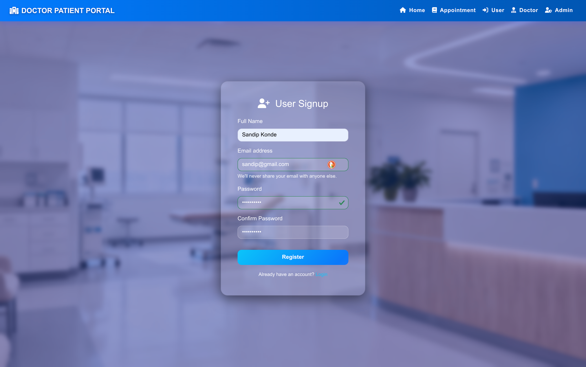 |

### 2. Admin Module (The Controller)
| Admin Login | Admin Dashboard |
| :---: | :---: |
| 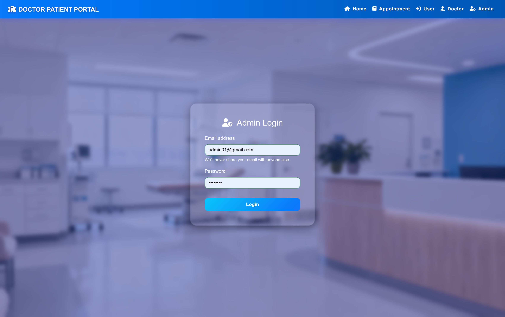 | 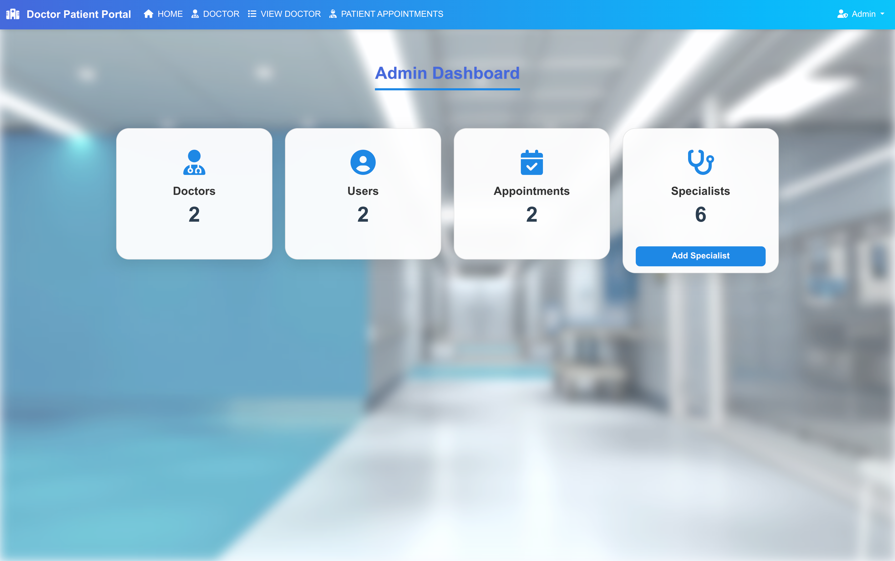 |

| Manage Doctors | Create New Doctor |
| :---: | :---: |
| 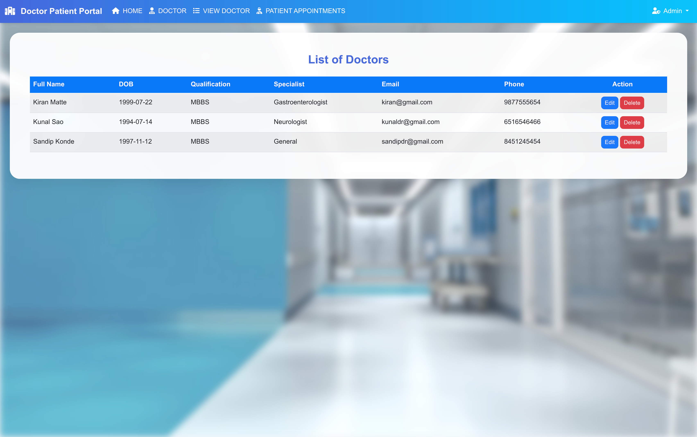 | 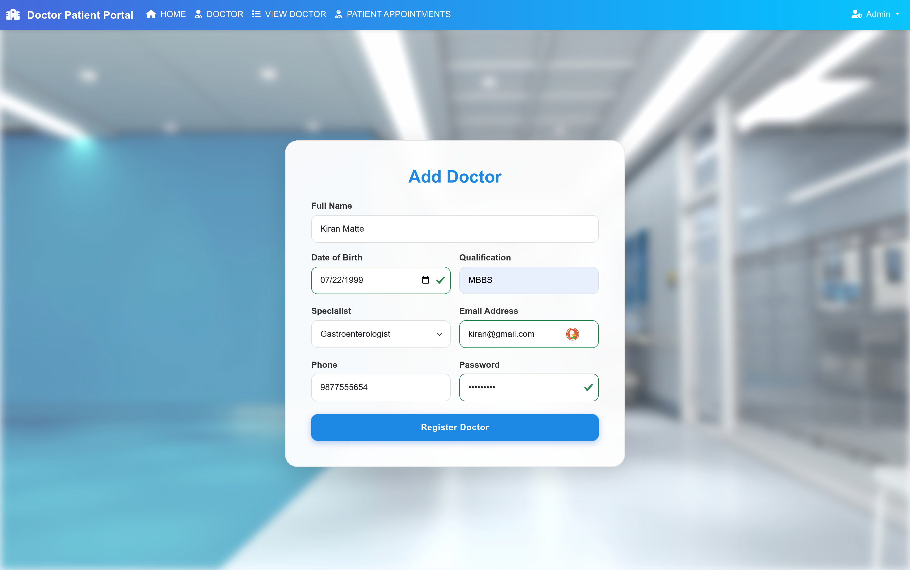 |

| Add Specialist | All Appointments (Admin View) |
| :---: | :---: |
| 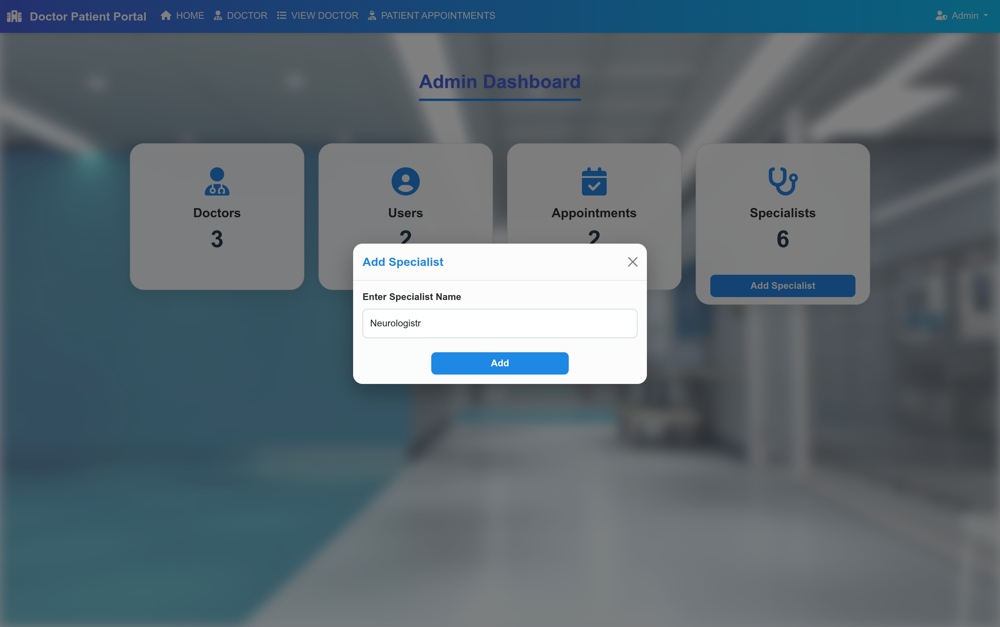 | 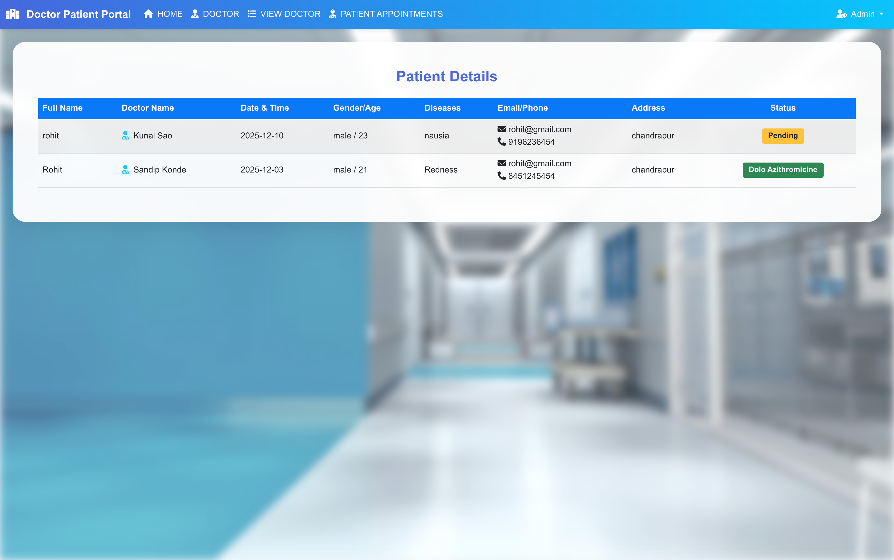 |

### 3. Doctor Module
| Doctor Dashboard | View Appointments |
| :---: | :---: |
| 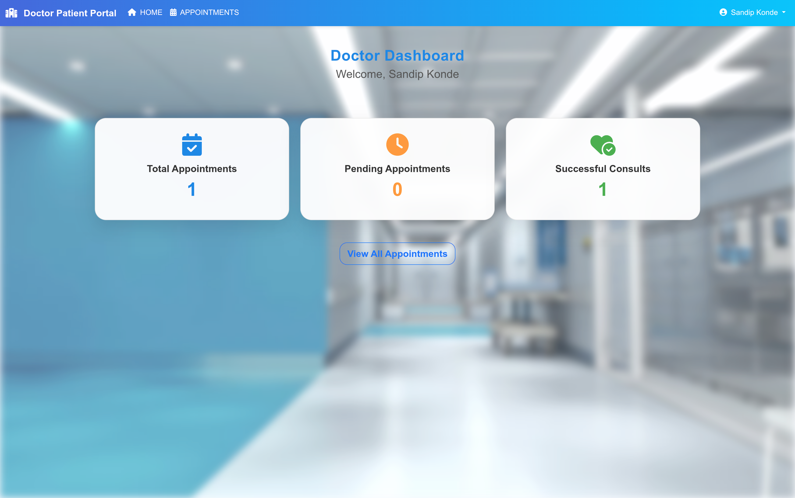 |  |

| Edit Profile |
| :---: |
| 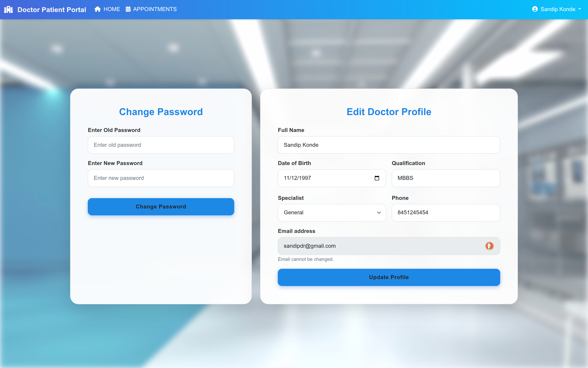 |

### 4. Patient Module
| Book Appointment | View Status |
| :---: | :---: |
| 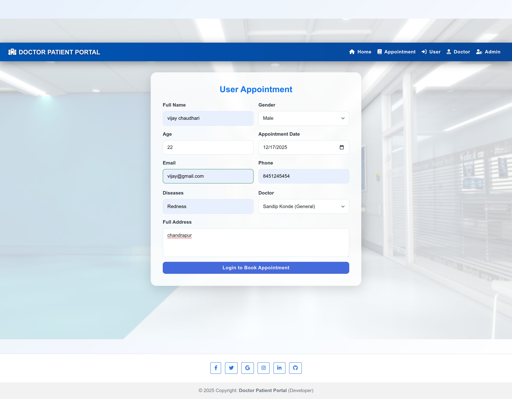 | 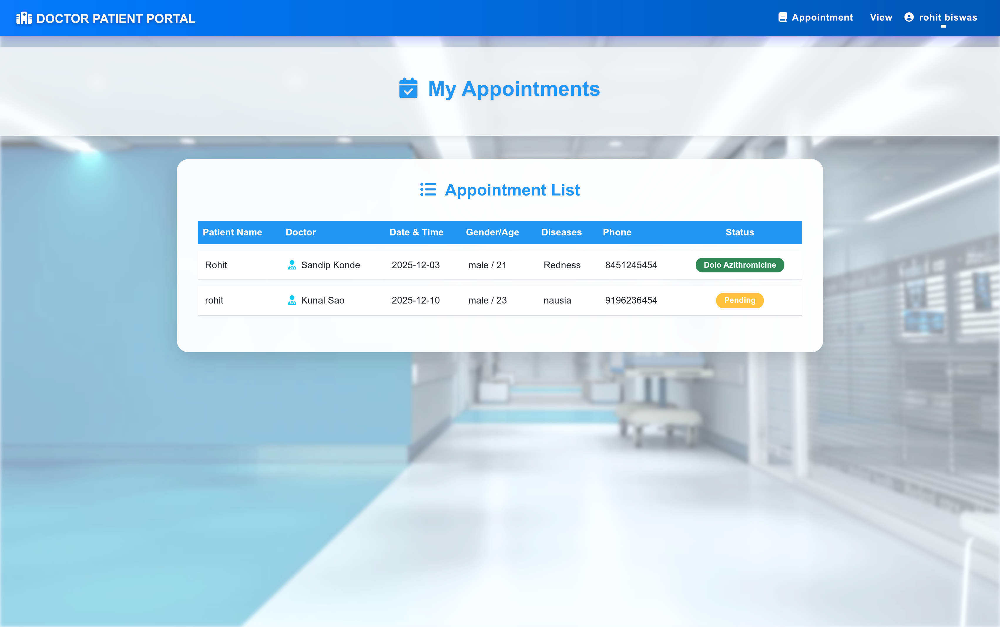 |

---

## How to Run (The Modern Way)

Since this project is **Dockerized**, you don't need to manually configure Apache Tomcat or MySQL on your machine.

### Prerequisites
* Docker & Docker Compose

### 1. Clone & Run
```bash
# Clone the repository
git clone [https://github.com/techiviju/Doctor-Patient-Portal.git](https://github.com/techiviju/Doctor-Patient-Portal.git)
cd Doctor-Patient-Portal

# Run with Docker Compose
docker-compose up --build
````

### 2\. Access the App

  * **Application:** Open `http://localhost:8080`
  * **Database (Internal):** The MySQL container initializes automatically with the schema.

-----

## ⚙️ How to Run (The Traditional Way)

If you prefer using an IDE like Eclipse:

1.  **Database:** Import the `database_schema.sql` file into your local MySQL Workbench.
2.  **Config:** Update `db.properties` with your local MySQL credentials.
3.  **Server:** Add the project to **Apache Tomcat 9.0+** server.
4.  **Run:** Right-click project -\> *Run As* -\> *Run on Server*.

-----

## 🛡️ Security & Validation

  * **Authentication:** Custom login logic with encrypted password handling.
  * **Session Management:** `HttpSession` is used to protect Dashboard routes (preventing unauthorized URL access).
  * **Input Validation:** both Client-side (HTML5/JS) and Server-side (Java) validation.

-----

## 🤝 Contact

**Vijay Chaudhari** (Full Stack Java Developer)

  * **GitHub:** [techiviju](https://www.google.com/search?q=https://github.com/techiviju)
  * **LinkedIn:** .[LinkedIn Profile](https://www.linkedin.com/in/vijay-achaudhari/)
  * **Email:** vijaychaudhari5220@gmail.com
  * **Portfolio** [Portfolio](https://vijaychportfolio.netlify.app/)

-----

⭐️ **Like this project?** Give it a Star\!
